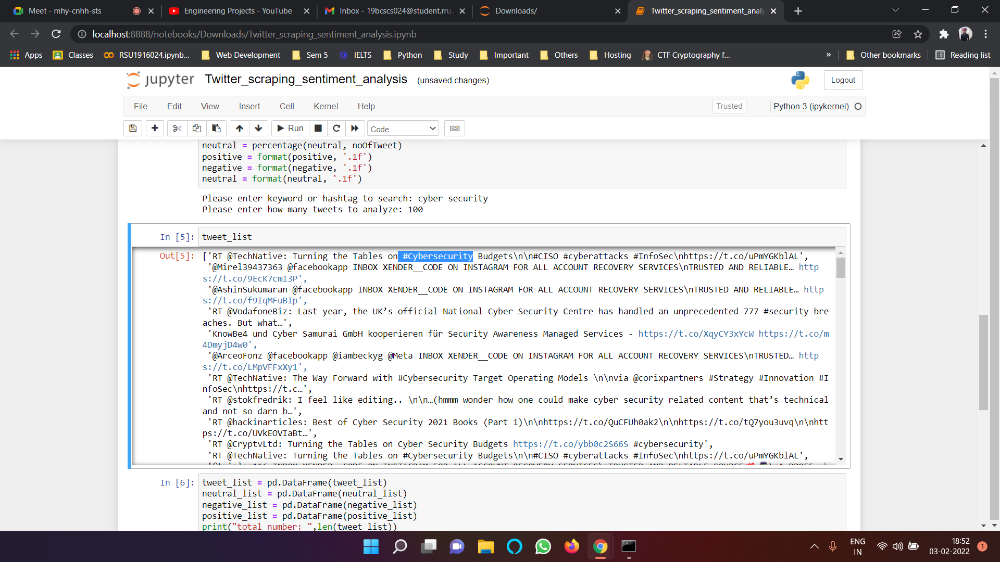

# Twitter-WebScraping-SentimentAnalysis
Our project is to extract data from twitter for a particular hashtag then we will analyze the sentiment of the public on twitter.
Web scraping is the process of using bots to extract content and data from a website.

Web scraping is the process of using bots to extract content and data from a website.
Unlike screen scraping, which only copies pixels displayed onscreen, web scraping extracts underlying HTML code and, with it, data stored in a database. The scraper can then replicate entire website content elsewhere.
For example: We want to get data of samsung,realme,redmi,one+ phones. From a web scraping of flipkart or amazon like websites and get previously mentioned data of phones.
In this code we use the Twitter API to extract the tweets and on that data we doing a sentiment analysis.

Output Of Program:

.png)

Watch The Video For More Details:
**https://youtu.be/99t-sqI4V**

